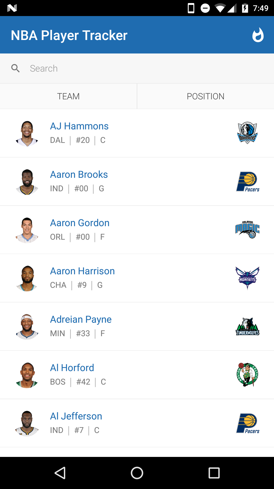
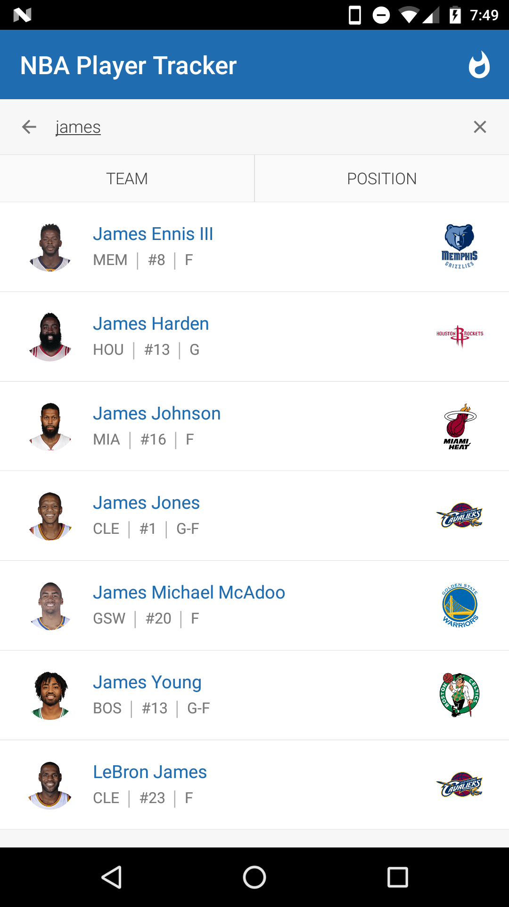
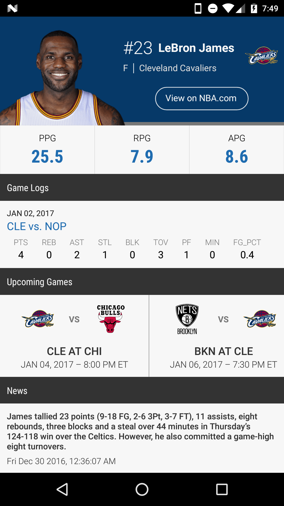
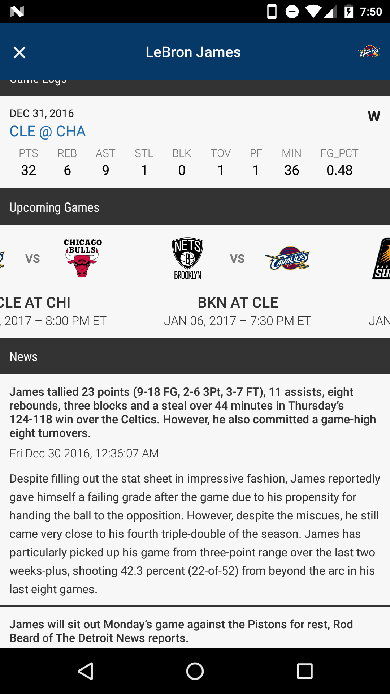
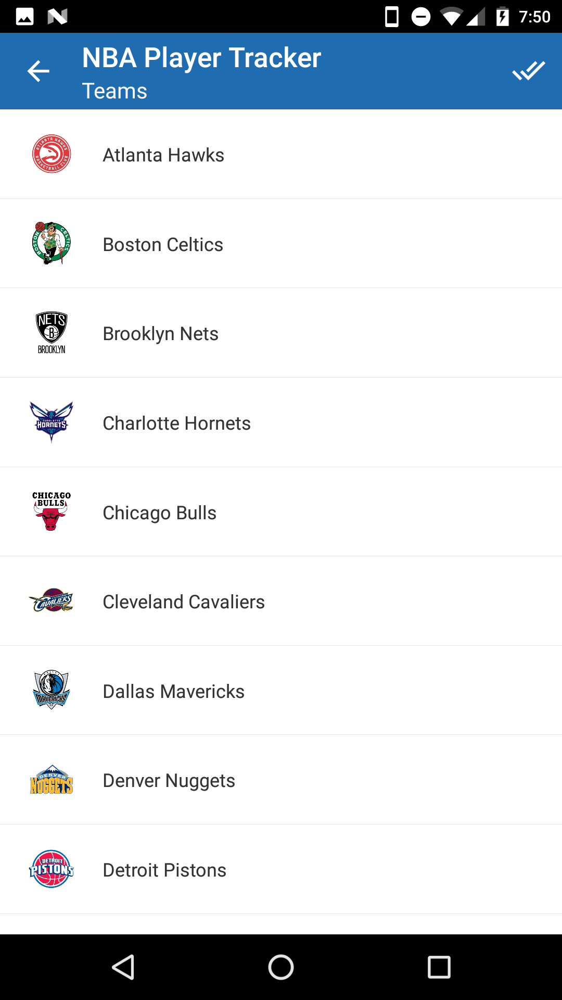
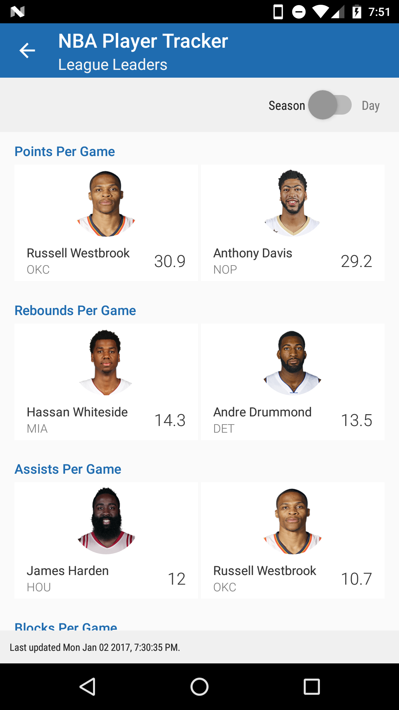
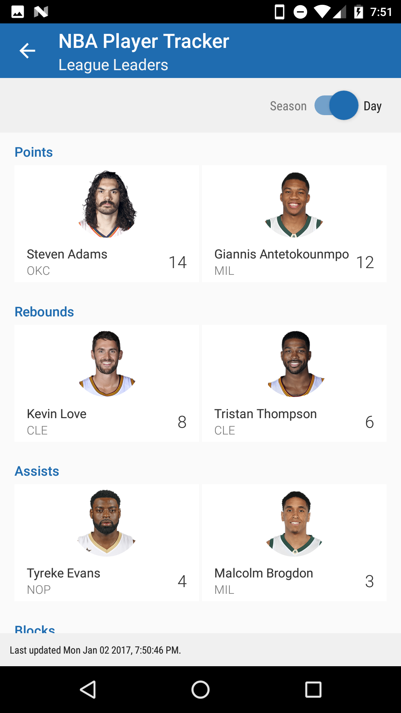

## nba-player-tracker

> Track and compare player stats, news, and game logs.

<a href='https://play.google.com/store/apps/details?id=com.kshvmdn.nbaplayertracker' target="_blank"></a>

### Screenshots

      

### Installation

  - Be sure to have [React Native](https://facebook.github.io/react-native/docs/getting-started.html#installing-dependencies) installed, as well as [Android Studio & AVD](https://facebook.github.io/react-native/docs/getting-started.html#android-development-environment).

  - Clone the repo., install dependenices.

    ```sh
    $ git clone https://github.com/kshvmdn/nba-player-tracker.git
    $ cd nba-player-tracker/NBAPlayerTracker
    $ yarn install
    ```

### Usage

  - I strongly suggest using this with an actual device if you can, but an emulator should work just as well.

  - With a device connected (or emulator running):

    ```sh
    $ react-native run-android
    ```

### Contribute

Have a request or find a bug? This project is completely open source, feel free to open an issue or submit a pull request.

The project uses a variety of [tools](./data) (incl. [Python 3](https://www.python.org/download/releases/3.0/), [jq](https://stedolan.github.io/jq/) and [cairosvg](http://cairosvg.org/)) to aggregate logo images and player data. This data is served from a public domain (http://nba.kshvmdn.com) and used within the application. If you're interested in local development, you generally _shouldn't_ need to worry about this stuff though.

